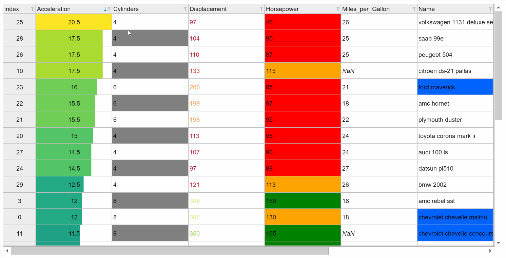
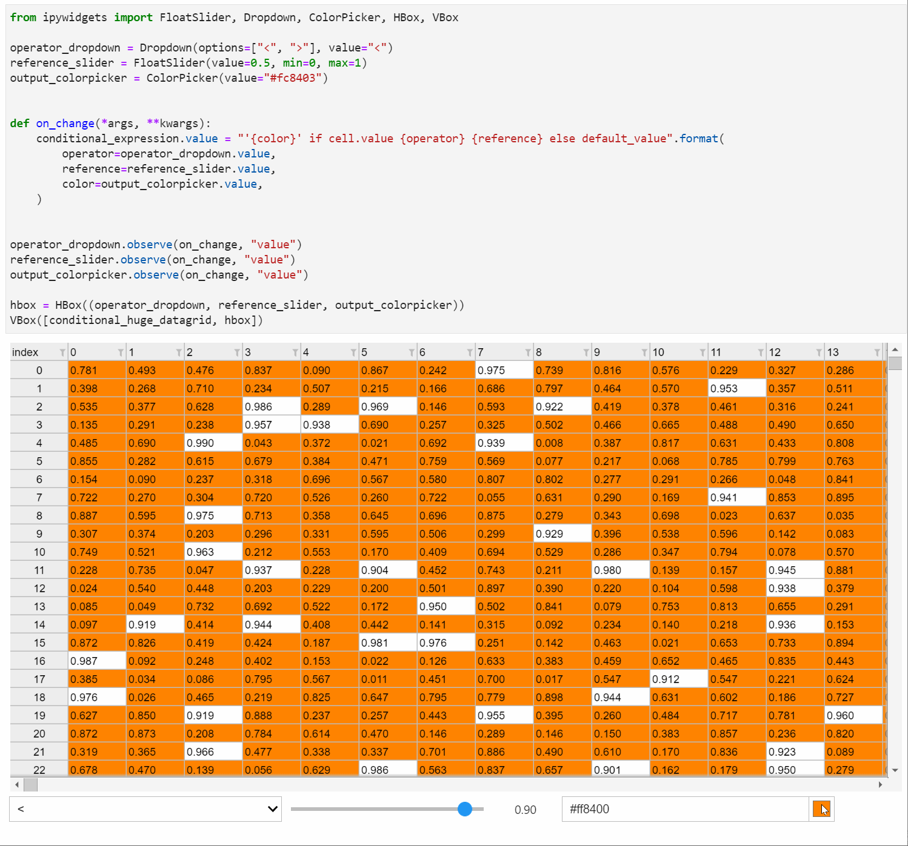
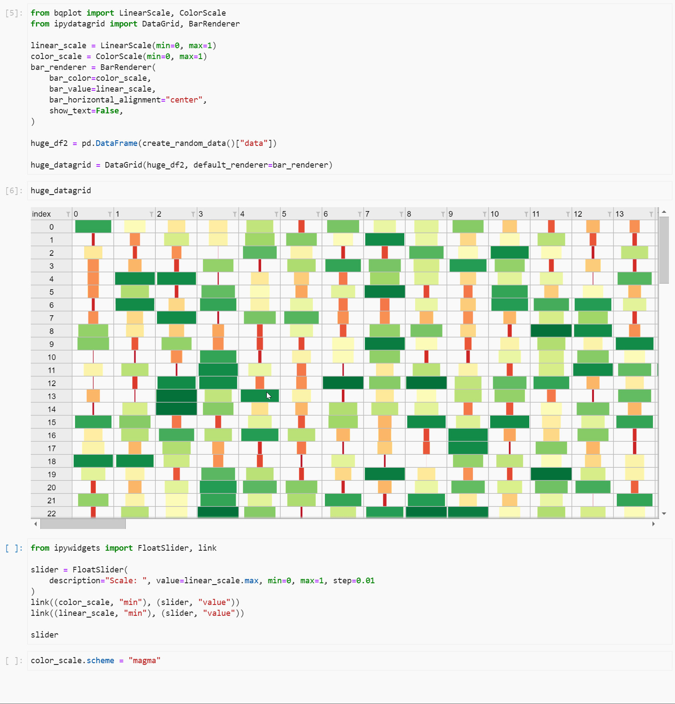
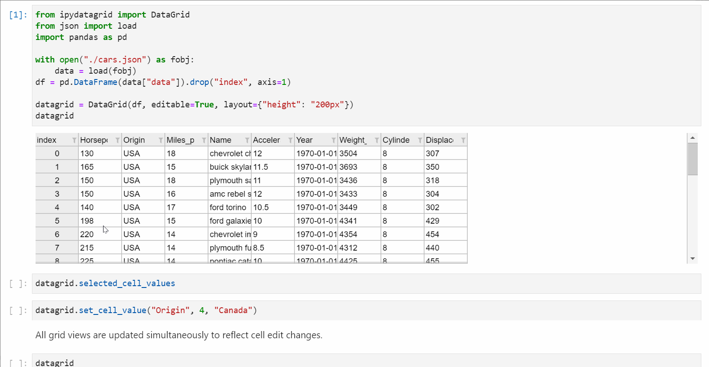
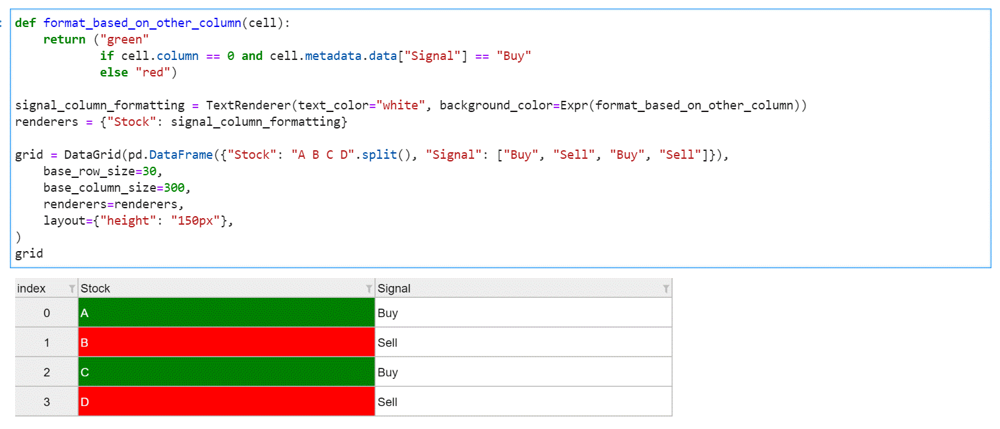

# ipydatagrid

[](https://mybinder.org/v2/gh/bloomberg/ipydatagrid/HEAD?urlpath=lab%2Ftree%2Fexamples%2FDataGrid.ipynb)
[](https://github.com/pre-commit/pre-commit)
[](https://github.com/prettier/prettier)
[](https://github.com/psf/black)
[](https://github.com/facebook/jest)

Fast Datagrid widget for the Jupyter Notebook and JupyterLab

## Menu

- [Usage and Examples](#Usage-and-Examples)
- [Installation](#Installation)
- [Development installation](#Development-installation)
- [Contributions](#Contributions)
- [License](#License)
- [Code of Conduct](#Code-of-Conduct)
- [Security Vulnerability reporting](#Security-Vulnerability-reporting)

## Usage and Examples

A fully-featured DataGrid interface
[](https://github.com/bloomberg/ipydatagrid/blob/main/examples/DataGrid.ipynb)

Highly performant and fully integrated with ipywidgets
[](https://github.com/bloomberg/ipydatagrid/blob/main/examples/DataGrid.ipynb)

Customize the way data is represented in your grid using a variety of renderers
[](https://github.com/bloomberg/ipydatagrid/blob/main/examples/DataGrid.ipynb)

Enjoy a sophisticated selections model with two-way data binding
[](https://github.com/bloomberg/ipydatagrid/blob/main/examples/Selections.ipynb)

Conditional formatting powered by Vega Expressions
[](https://github.com/bloomberg/ipydatagrid/blob/main/examples/ConditionalFormatting.ipynb)

Tutorial and example notebooks can be found in the `/examples` directory.

## Installation

If using JupyterLab, `ipydatagrid` requires JupyterLab version 3 or higher.

You can install `ipydatagrid` using `pip` or `conda`:

Using `pip`:

```bash
pip install ipydatagrid
```

Using `conda`:

```bash
conda install -c conda-forge ipydatagrid
```

If you are using Jupyter Notebook 5.2 or earlier, you may also need to enable
the nbextension:

```bash
jupyter nbextension enable --py [--sys-prefix|--user|--system] ipydatagrid
```

NOTE: For examples using Scales from bqplot to work as intended, the bqplot notebook and lab extensions must be installed as well. See the [bqplot repo](https://github.com/bqplot/bqplot) for installation instructions:

## Development installation

For a development installation:

```bash
git clone https://github.com/Bloomberg/ipydatagrid.git
cd ipydatagrid
conda install ipywidgets=8 jupyterlab
pip install -ve .
```

Enabling development install for Jupyter notebook:

```bash
jupyter nbextension install --py --symlink --sys-prefix ipydatagrid
jupyter nbextension enable --py --sys-prefix ipydatagrid
```

Enabling development install for JupyterLab:

```bash
jupyter labextension develop . --overwrite
```

Note for developers: the `--symlink` argument on Linux or OS X allows one to modify the JavaScript code in-place. This feature is not available with Windows.

If you are changing TypeScript code you can watch for code changes and automatically rebuild using
```bash
jlpm watch
```
in one terminal and
```bash
jupyter lab
```
(or `jupyter notebook` or similar) in another.

## Contributions

We :heart: contributions.

The ipydatagrid package is under the [Jupyter-Widgets](https://github.com/jupyter-widgets) [software subproject](https://jupyter.org/governance/software_subprojects.html).

We appreciate contributions from the community.

We follow the [IPython Contributing Guide](https://github.com/ipython/ipython/blob/main/CONTRIBUTING.md)
and [Jupyter Contributing Guides](https://jupyter.readthedocs.io/en/latest/contributor/content-contributor.html)

## License

Please read the [LICENSE](LICENSE.txt) file.

## Code of Conduct

This project has adopted a [Project Jupyter's Code of Conduct](https://github.com/jupyter/governance/blob/master/conduct/code_of_conduct.md)bloo.

## Security Vulnerability Reporting

If you believe you have identified a security vulnerability in this project, please raise an issue to the project,
detailing the suspected problem and any methods you've found to reproduce it.

Please do NOT open an issue in the GitHub repository, as we'd prefer to keep vulnerability reports private until
we've had an opportunity to review and address them.
